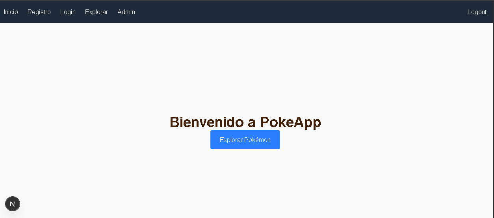
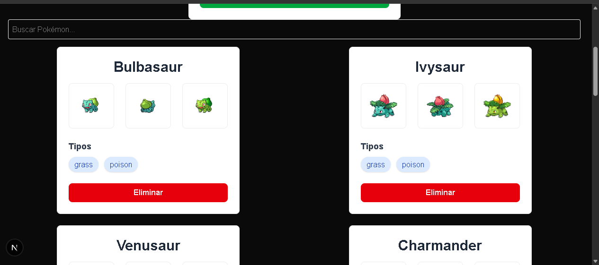
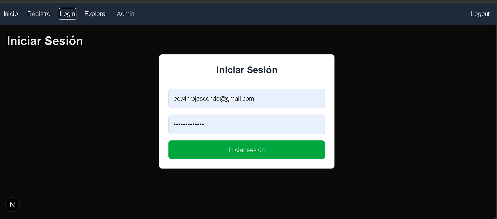

# PokeApp — Plataforma Interactiva de Pokémon

Aplicación web interactiva que permite a los usuarios explorar datos detallados de Pokémon mediante la PokéAPI, gestionar una colección personalizada con persistencia en la base de datos y participar en una comunidad compartiendo comentarios en tiempo real.

🔗 **Demo en vivo**: [https://tu-proyecto.vercel.app](https://tu-proyecto.vercel.app) _(reemplaza con tu URL de Vercel)_

---

## Capturas de pantalla







---

## Stack tecnológico

- **Next.js**: 15.x / 14.x (App Router & Server Actions)
- **TypeScript**: 5.x
- **Tailwind CSS**: 4.x
- **Supabase**: `@supabase/ssr` (PostgreSQL Database + Auth con Triggers + Row Level Security)
- **PokéAPI**: REST API externa para la obtención de datos de Pokémon
- **Vercel**: Plataforma de despliegue continuo (Hosting & CD)

---

## Roles de usuario

- **Usuario Visitante (GUEST)**:
  - Puede visualizar la página de bienvenida y explorar el listado base de Pokémon.
  - Tiene acceso a la creación de una nueva cuenta de usuario o inicio de sesión.

- **Usuario Autenticado (USER)**:
  - Tiene un perfil registrado generado automáticamente en la base de datos vía Trigger.
  - Puede agregar nuevos Pokémon personalizados a la base de datos local.
  - Puede eliminar o editar Pokémon asociados a su cuenta.
  - Puede escribir comentarios en los perfiles de cada Pokémon.

- **Administrador (ADMIN)**:
  - Cuenta con acceso exclusivo a la ruta protegida `/admin`.
  - Dispone de permisos elevados para la gestión global del sistema y usuarios.

---

## Modelo de datos

El esquema relacional en PostgreSQL (Supabase) está estructurado de la siguiente manera:

1. **`auth.users`** _(Tabla interna de Supabase Auth)_:
   - Contiene la información de autenticación (`id`, `email`, `encrypted_password`).

2. **`public.profiles`**:
   - `id` (UUID, Primary Key, Foreign Key -> `auth.users.id` con borrado en cascada).
   - `username` (TEXT, Not Null).
   - `role` (TEXT, Default: `'user'`).
   - _Nota: Se crea automáticamente mediante un Trigger de PostgreSQL al registrarse un usuario en `auth.users`._

3. **`public.pokemons`**:
   - `id` (UUID / BIGINT, Primary Key).
   - `name` (TEXT, Not Null).
   - `type` (TEXT, Not Null).
   - `user_id` (UUID, Foreign Key -> `auth.users.id`).
   - `created_at` (TIMESTAMP WITH TIME ZONE, Default: `now()`).

4. **`public.comments`**:
   - `id` (BIGINT / UUID, Primary Key).
   - `pokemon_id` (BIGINT / INTEGER, Not Null).
   - `user_id` (UUID, Foreign Key -> `public.profiles.id`).
   - `content` (TEXT, Not Null).
   - `created_at` (TIMESTAMP WITH TIME ZONE, Default: `now()`).

---

## Instalación local

Sigue estos pasos para clonar y ejecutar el proyecto localmente en tu entorno de desarrollo:

1. **Clonar el repositorio:**
   ```bash
   git clone [https://github.com/Pacificador1948/pokeapp.git](https://github.com/Pacificador1948/pokeapp.git)
   cd pokeapp
   ```

##Rol de usario
Correo: usuario@ejemplo.com

Contraseña: Usuario123

##Rol de administrador
Correo: admin@ejemplo.com

Contraseña: Admin123

Autor

Edwin Rojas
